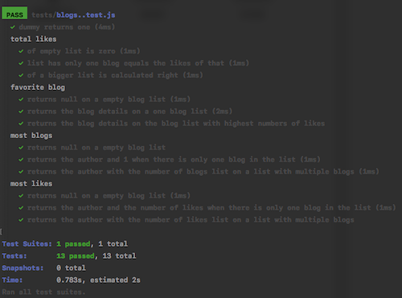

# Exercises

- 4.1 Blog list - turn an application body into a functioning npm project.
  - config `nodemon`
  - create a database
  - test the backend make sure all endpoints work correctly

#

- 4.2 Bolg list - refactor the application into separate modules

#

- 4.3 Bolg list - helper functions and unit tests
  - define a `dummy` function that receives an array of blog posts as a parameter and always returns the value 1.
  - install [jest](https://jestjs.io/)
    - `npm install --save-dev jest`
    - define the `npm script` `test` to execute tests with Jest and to report about the test execution with the `verbose` style
      - `"test": "jest --verbose"` in the `script` of the `package.json`
    - specify that the execution environment is Node (package.json)
      ```javascript
        "jest": {
          "testEnvironment": "node"
        }
      ```
    - or create a configuration file with the default name `jest.config.js`
      ```javascript
      module.exports = {
        testEnvironment: "node"
      };
      ```
    - the `.eslintrc.js`
      ```javascript
        module.exports = {
        "env": {
          "commonjs": true
          "es6": true,
          "node": true,
          "jest": true,  },
        "extends": "eslint:recommended",
        "rules": {
          // ...
        },
      };
      ```

#

- 4.4 Bolg list - helper functions and unit tests
  - define a new `totalLikes` function that receives a list of blog posts as a parameter. The function returns the total sum of likes in all of the blog posts.
  - **tips**
    - run a single test with [only](https://jestjs.io/docs/en/api.html#testonlyname-fn-timeout) method
    - run a single test with [-t flag](https://jestjs.io/docs/en/cli.html)
      - `npx jest -t 'when list has only one blog equals the likes of that'`

#

- 4.5 Bolg list - helper functions and unit tests

  - define a new `favoriteBlog` function that receives a list of blogs as a parameter. The function finds out which blog has most likes. If there are many top favorites, it is enough to return one of them.

#

- 4.6, 4.7 Bolg list - helper functions and unit tests
  - can use `lodash`
  - define a function called `mostBlogs` that receives an array of blogs as a parameter. The function returns the author who has the largest amount of blogs.
  - define a function called `mostLikes` that receives an array of blogs as its parameter. The function returns the author, whose blog posts have the largest amount of likes.

#

  <p align="center">
    
  </p>

#

- 4.8 Blog list tests

  - write a test that makes an **HTTP GET** request to the `/api/blogs url`. Verify that the blog list application returns the correct amount of blog posts in the JSON format.
  - refactor the route handler to use the async/await syntax instead of promises.

  ##### --

  **- modify the way that our application runs in different modes so that we could define the application to use a separate test databse when it's running tests**

  - set up `NODE_DEV` in package.json

  ```javascript
    "start": "cross-env NODE_ENV=production node index.js",
    "watch": "cross-env NODE_ENV=development nodemon index.js",
    "test": "cross-env NODE_ENV=test jest --verbose --runInBand"
  ```

  - [runInBand](https://jestjs.io/docs/en/cli.html#--runinband) - prevent Jest from running tests in parallel.
  - [cross-env](https://www.npmjs.com/package/cross-env)
  - change configuration in `.config.js`
    ```javascript
    if (process.env.NODE_ENV === "test") {
      MONGODB_URI = process.env.TEST_MONGODB_URI;
    }
    ```
  - [supertest](https://github.com/visionmedia/supertest) - install it as a dev dependency for testing API
  - [afterAll](https://jestjs.io/docs/en/api.html#afterallfn-timeout) method
  - error handling - [jest mongoose error handleing](https://mongoosejs.com/docs/jest.html)

    - add a `jest.config.js` file

      ```javascript
      module.exports = {
        testEnvironment: "node"
      };
      ```

  - The tests only use the express application defined in the app.js file, and the `supertest` takes care that the application being tested is started at the port that it uses internally.

  ```javascript
  const mongoose = require("mongoose");
  const supertest = require("supertest");
  const app = require("../app");
  const api = supertest(app);
  // ...
  ```

#

- 4.9 Blog list tests

  - write a test that verifies that the unique identifier property of the blog posts is named id, by default the database names the property `_id`.
  - verify the existence of a property is easily done with Jest's [toBeDefined](https://jestjs.io/docs/en/expect#tobedefined) matcher

  ##

  - Initialising the database before running tests
  - [beforeEach](https://jestjs.io/docs/en/api.html#beforeeachfn-timeout) - executing operations once before any test is run, or every time before a test is run.

  - [toContain](https://jestjs.io/docs/en/expect.html#tocontainitem)

  - `npx jest -t "blogs"` - run all of the tests that contain blogs in their name

#

- 4.10 Blog list tests
  - write a test that verifies that making an **HTTP POST** request to the `/api/blogs`url successfully creates a new blog post.
  - verify that the total number of blogs in the system is increased by one.
  - also verify that the content of the blog post is saved correctly to the database.

#

- 4.11 Blog list tests
  - write a test that verifies that if the `likes` property is missing from the request, it will default to the value 0.

#

- 4.12 Blog list tests
  - write a test related to creating new blogs via the `/api/blogs` endpoint, that verifies that if the `title` and `url` properties are missing from the request data, the backend responds to the request with the status `code 400 Bad Request`.

#

- 4.13 Blog list tests
  - implement functionality for deleting a single blog post resource.
  - use async/await and follow REST API conventions when defining the HTTP API

#

- 4.14 Blog list tests
  - implement functionality for updating the information of an individual blog post.
  - use async/await
